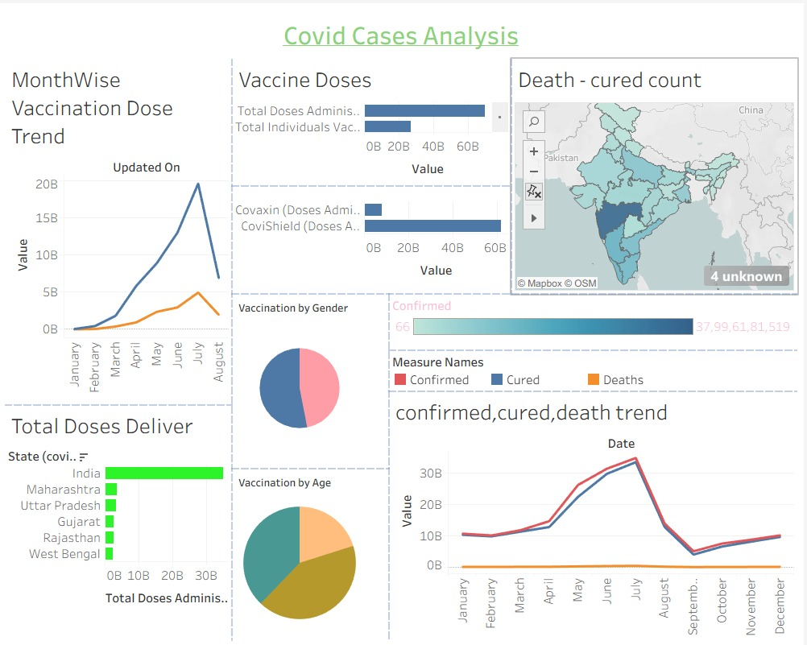

# 🦠 COVID‑19 Cases Analysis Dashboard (Power BI Project)

# 1. Problem Statement

During the COVID‑19 pandemic, governments and health organizations
needed clear insights into:

-   Growth of confirmed cases
-   Vaccination progress
-   Death vs recovery rates
-   State‑wise vaccine distribution
-   Monthly pandemic trends

However, raw data from multiple sources was difficult to interpret
quickly.\
Decision makers required a **visual and interactive analytics
dashboard** to monitor pandemic trends and vaccination progress.

The objective of this project was to develop a **Power BI dashboard**
that transforms raw COVID‑19 data into meaningful insights for
monitoring the spread of the virus and the effectiveness of vaccination
programs.

# 2. Data Source

Dataset: **COVID‑19 India Dataset**

Key attributes used:

-   Date
-   State
-   Confirmed Cases
-   Recovered Cases
-   Death Cases
-   Total Vaccination Doses
-   Vaccine Type
-   Age Group
-   Gender

# 3. Process (Data Analytics Workflow)

## Data Collection

Collected COVID‑19 datasets containing information about:

-   Confirmed cases
-   Recoveries
-   Deaths
-   Vaccination doses administered
-   State‑wise data across India

## Data Cleaning

Performed preprocessing to improve data quality:

-   Removed missing and inconsistent records
-   Standardized state names
-   Corrected date formats
-   Converted numerical values for analysis

## Data Transformation (Power Query)

Key transformations performed:

-   Created calculated columns
-   Aggregated monthly case data
-   Categorized vaccination by age and gender
-   Structured datasets for visualization

## Data Modeling

Built measures using **DAX** to analyze key metrics.

Average Confirmed Cases

    Average Confirmed = AVERAGE(CovidData[Confirmed])

Total Vaccination Doses

    Total Doses = SUM(CovidData[Total_Doses])

Total Deaths

    Total Deaths = SUM(CovidData[Deaths])

# 4. Dashboard Design

The dashboard was designed to provide **clear pandemic insights using
interactive visuals**.

### Key Visualizations

**1. Month‑Wise Vaccination Trend** - Shows vaccination progress across
months.

**2. Vaccine Dose Distribution** - Displays total doses administered and
individuals vaccinated.

**3. Death vs Recovery Map** - Geographic visualization of pandemic
impact across India.

**4. State‑Wise Total Doses** - Highlights which states administered the
most vaccines.

**5. Vaccination by Gender** - Compares male and female vaccination
rates.

**6. Vaccination by Age Group** - Shows which age groups received the
most vaccines.

**7. Confirmed vs Recovered vs Death Trends** - Tracks pandemic
progression over time.

# 5. Key Insights

## 1️⃣ Vaccination Increased Rapidly Mid‑Year

Vaccination rates increased significantly between **May and July**,
indicating strong vaccination drives during that period.

## 2️⃣ Recovery Rates Were Higher Than Death Rates

Recovered cases consistently remained higher than deaths, showing
improvement in treatment and healthcare response.

## 3️⃣ State‑Wise Vaccination Distribution

Large states such as **Maharashtra and Uttar Pradesh** administered the
highest number of vaccine doses.

## 4️⃣ Gender Distribution in Vaccination

Vaccination rates between male and female populations were relatively
balanced.

## 5️⃣ Age Group Trends

Middle‑aged populations received the largest share of vaccines compared
to other age groups.

# 6. Business / Social Impact

This dashboard helps:

### Government Authorities

-   Monitor pandemic spread
-   Track vaccination campaigns
-   Identify high‑risk regions

### Healthcare Organizations

-   Allocate medical resources efficiently
-   Analyze recovery trends

### Public Health Researchers

-   Study pandemic patterns
-   Evaluate vaccination effectiveness

# 7. Tools & Technologies Used

  Tool          Purpose
  ------------- --------------------------------
  Power BI      Data Visualization
  Power Query   Data Cleaning & Transformation
  DAX           Data Modeling
  Excel / CSV   Data Source

# 8. Skills Demonstrated

This project demonstrates strong **data analytics and visualization
skills**:

-   Data Cleaning
-   Data Transformation
-   Data Visualization
-   Dashboard Design
-   Data Storytelling
-   Public Health Data Analysis
-   Interactive Reporting

⭐ **Project Outcome:**\
Developed an interactive COVID‑19 analytics dashboard that provides
actionable insights into vaccination progress, case trends, and recovery
patterns using Power BI.
