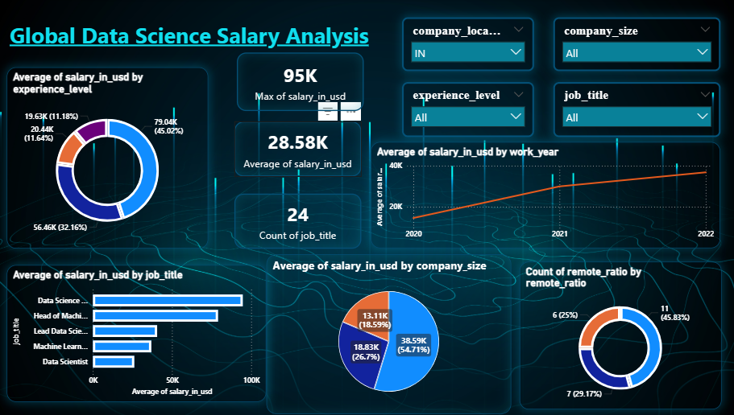

# Global Data Science Salary Analysis (Power BI Project)

## Dashboard Preview

# 1. Problem Statement

The data science job market is growing rapidly, but salary structures
vary depending on:

-   Experience level
-   Job role
-   Company size
-   Remote work policies
-   Geographic location

Many job seekers and companies lack clear insights into salary trends
across these factors.

This project builds an interactive **Power BI dashboard** to analyze
global data science salary data and help users understand:

-   Which roles pay the most
-   How experience affects salary
-   Impact of remote work
-   Salary trends over time
-   Salary differences across company sizes

# 2. Data Source

Dataset: **Global Data Science Salaries Dataset**

Key fields used:

-   salary_in_usd
-   experience_level
-   job_title
-   company_size
-   company_location
-   remote_ratio
-   work_year

# 3. Process (Data Analytics Workflow)

## Data Cleaning

-   Removed duplicate records
-   Handled missing values
-   Standardized job titles
-   Converted salary values into USD

## Data Transformation (Power Query)

-   Data type corrections
-   Creating calculated columns
-   Grouping job roles
-   Filtering inconsistent entries

## Data Modeling

Created measures using DAX:

**Average Salary**

    Average Salary = AVERAGE(dataset[salary_in_usd])

**Maximum Salary**

    Max Salary = MAX(dataset[salary_in_usd])

**Total Job Titles**

    Job Count = DISTINCTCOUNT(dataset[job_title])

# 4. Dashboard Design

Interactive dashboard components:

### Slicers

-   Company Location
-   Company Size
-   Experience Level
-   Job Title

### Visualizations

-   Salary by Experience Level (Donut Chart)
-   Salary Trend by Year (Line Chart)
-   Salary by Job Title (Bar Chart)
-   Salary by Company Size (Pie Chart)
-   Remote Work Distribution (Donut Chart)

### KPI Cards

-   Maximum Salary
-   Average Salary
-   Total Job Roles

# 5. Key Insights

## Experience Drives Salary Growth

Senior and executive-level professionals earn significantly higher
salaries compared to entry-level roles.

## Job Role Impacts Salary

Highest paying roles include: - Head of Machine Learning - Data Science
Lead - Machine Learning Engineer

## Company Size Matters

Large companies tend to offer higher salaries compared to small
companies.

## Remote Work Trends

Remote and hybrid jobs are becoming more common in the data science
industry.

## Salary Growth Over Time

Salary trends show steady growth between 2020--2022, reflecting
increased demand for data science professionals.

# 6. Business Impact

This dashboard helps:

### Job Seekers

-   Understand salary benchmarks
-   Identify high-paying roles
-   Plan career growth

### Companies

-   Benchmark salaries
-   Create competitive compensation packages

### Recruiters

-   Understand hiring trends
-   Align hiring strategies with market demand

# 7. Tools Used

  Tool          Purpose
  ------------- --------------------
  Power BI      Data Visualization
  Power Query   Data Cleaning
  DAX           Data Modeling
  Excel/CSV     Data Source

# 8. Skills Demonstrated

-   Data Cleaning
-   Data Transformation
-   DAX Calculations
-   Data Visualization
-   Dashboard Design
-   Business Insight Generation
-   Interactive Reporting
