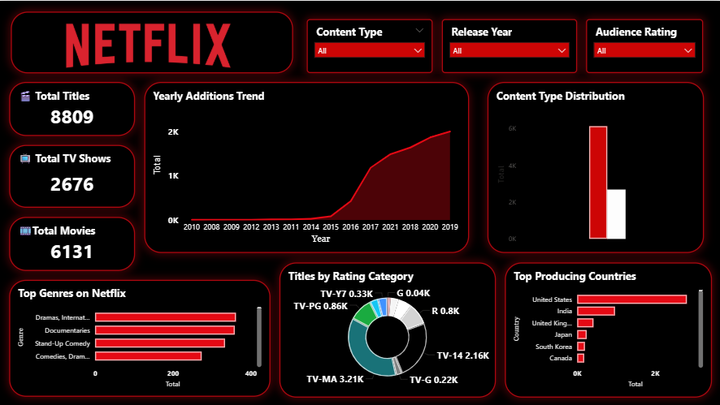

# Netflix Content Analysis Dashboard (Power BI Project)

## Dashboard Preview

# 1. Problem Statement

Streaming platforms like Netflix host thousands of titles including
movies and TV shows across different countries, genres, and audience
ratings.

However, understanding: - How the Netflix content library is
distributed - Which countries produce the most content - Which genres
dominate the platform - How Netflix content has grown over time

can be difficult without proper visualization.

**Goal:**\
Build an interactive **Power BI dashboard** to analyze Netflix's content
library and extract meaningful insights about its distribution, growth,
and audience targeting.

# 2. Project Workflow

## Step 1: Data Collection

The dataset contains information about Netflix titles including:

-   Title
-   Type (Movie / TV Show)
-   Release Year
-   Country
-   Rating
-   Genre
-   Date Added
-   Duration

This dataset was used to understand Netflix's content distribution and
trends.

## Step 2: Data Cleaning (Power Query)

The following transformations were performed:

-   Converted **Date Added** column into Date format
-   Removed null or missing values
-   Standardized **country and genre names**
-   Split columns where multiple values existed
-   Renamed columns for better readability

These steps ensured that the dataset became clean, structured, and
analysis-ready.

## Step 3: Data Modeling

Relationships and calculated measures were created in Power BI such as:

**Measures:**

-   Total Titles
-   Total Movies
-   Total TV Shows
-   Content by Rating
-   Titles by Country
-   Titles by Genre

These measures helped build meaningful visualizations.

## Step 4: Dashboard Design

The dashboard includes the following components:

### KPI Cards

-   Total Titles
-   Total Movies
-   Total TV Shows

### Visualizations

-   **Yearly Additions Trend** -- shows how Netflix content grew over
    time
-   **Content Type Distribution** -- comparison of Movies vs TV Shows
-   **Top Genres on Netflix**
-   **Titles by Rating Category**
-   **Top Producing Countries**

### Filters (Slicers)

-   Content Type
-   Release Year
-   Audience Rating

These filters allow users to interactively explore the dataset.

# 3. Key Insights

## 1. Netflix Library Size

Netflix currently has **8,809 titles** in this dataset.

-   **Movies:** 6,131\
-   **TV Shows:** 2,676

Movies dominate the platform.

## 2. Content Growth Trend

The dashboard shows a sharp increase in titles after **2016**.

This indicates: - Major investment in content production - Global
expansion of Netflix

## 3. Content Type Distribution

Movies significantly outnumber TV shows.

However, TV shows generally provide: - Longer viewer engagement -
Multi-season content

## 4. Most Popular Genres

Top genres include:

-   Drama
-   International Movies
-   Documentaries
-   Stand‑Up Comedy

This shows Netflix heavily focuses on **story-driven and documentary
content**.

## 5. Audience Rating Analysis

Most titles fall into:

-   **TV‑MA**
-   **TV‑14**

This indicates Netflix primarily targets **teen and adult audiences**
rather than children.

## 6. Top Content Producing Countries

Leading countries include:

1.  United States
2.  India
3.  United Kingdom
4.  Japan
5.  South Korea
6.  Canada

The **United States dominates the platform**, but international content
is growing rapidly.

# 4. Business Impact

This dashboard helps:

-   Understand Netflix's **content strategy**
-   Identify **dominant genres**
-   Analyze **global content production**
-   Track **content growth trends**

Companies can use this type of dashboard to improve **content investment
decisions**.

# 5. Future Improvements

The dashboard can be enhanced by adding:

-   Top **Directors and Actors analysis**
-   **Genre trend over time**
-   **Country-wise growth analysis**
-   **Viewer ratings vs popularity**
-   **Recommendation insights using Machine Learning**

# 6. Tools Used

-   **Power BI** -- Dashboard & Visualization
-   **Power Query** -- Data Cleaning
-   **DAX** -- Measures and calculations

# 7. Project Outcome

This project demonstrates skills in:

-   Data Cleaning
-   Data Modeling
-   Dashboard Design
-   Data Storytelling
-   Business Insight Generation

Such dashboards are commonly used by **data analysts and business
intelligence teams** to convert raw data into actionable insights.
