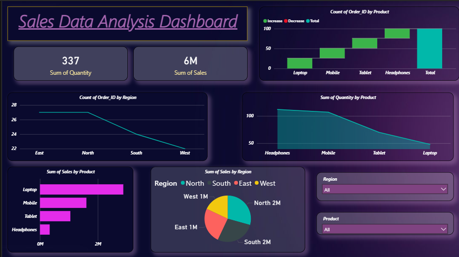

# Sales Data Analysis Dashboard (Power BI Project)

## 1. Problem

Businesses generate large amounts of sales data every day.  
However, raw data alone does not clearly show:

- Which products generate the highest revenue  
- Which regions contribute the most sales  
- Which products have the highest demand  
- How sales performance varies across products  

Without proper visualization, it becomes difficult for decision-makers to understand trends and make strategic decisions.

The goal of this project was to build a **Power BI dashboard** that converts raw sales data into clear visual insights.

## 2. Process

### Data Source
The dataset contains the following fields:

- Order ID  
- Product  
- Region  
- Quantity  
- Sales  

### Data Cleaning
The dataset was prepared before analysis:

- Removed duplicate rows  
- Handled missing values  
- Standardized product names  
- Converted numerical columns properly  

### Data Transformation
Using **Power Query**:

- Aggregated sales by product  
- Aggregated sales by region  
- Prepared the dataset for visualization  

## 3. Dashboard Components

The Power BI dashboard includes:

**KPI Cards**
- Total Quantity Sold
- Total Sales Revenue

**Charts**
- Order count by product
- Sales by product
- Quantity by product
- Sales by region
- Order count by region

**Filters**
- Region
- Product

These filters allow users to explore sales data interactively.

## 4. Key Insights

### Laptop Sales Are Highest
Laptops generate the highest sales revenue compared to other products.

### Mobile Products Have Strong Demand
Mobile devices contribute significantly to total sales.

### Regional Performance
North and South regions generate the highest sales compared to East and West.

### Headphones Have High Demand but Lower Revenue
Headphones have many orders but lower revenue due to lower product price.

## 5. Business Impact

This dashboard helps businesses:

**Management**
- Monitor sales performance
- Identify top performing products

**Sales Teams**
- Focus on high demand products
- Target strong regions

**Decision Makers**
- Improve pricing strategies
- Optimize inventory planning

## 6. Tools Used

| Tool | Purpose |
|-----|------|
| Power BI | Dashboard Visualization |
| Power Query | Data Cleaning |
| DAX | Data Modeling |
| Excel / CSV | Dataset |

## 7. Skills Demonstrated

- Data Cleaning  
- Data Transformation  
- Data Visualization  
- Dashboard Design  
- Business Intelligence  

## Project Outcome

Created an **interactive Power BI Sales Dashboard** that helps analyze product performance, regional sales trends, and overall business performance.